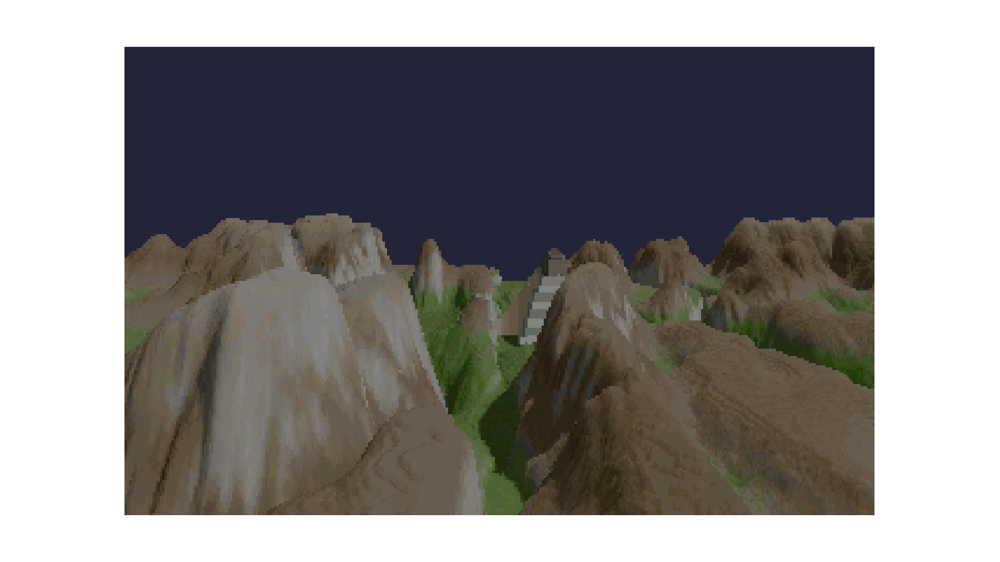

# voxel-renderer

A voxel space renderer in Python with pyglet (Comanche style)
Based in tutorial by Pikuma https://www.youtube.com/watch?v=bQBY9BM9g_Y

## Controls

- Move with W, A, S, D
- Turn with Q, E, and arrow keys
- Elevate up and down with R, F
- Close with ESC

## Usage

- Install dependencies with: `$ python -m pip install -r requirements.txt`
- Run main program: `$ python main.py`
