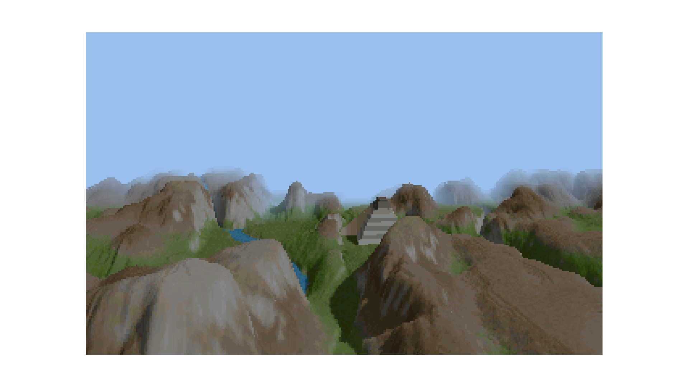

# voxel-renderer

A voxel space renderer in Python with pyglet (Comanche style)

## Controls

- Move with W, A, S, D
- Turn with Q, E, and arrow keys
- Elevate up and down with R, F

## To do:

- Sky
- Viewport
- Fog
